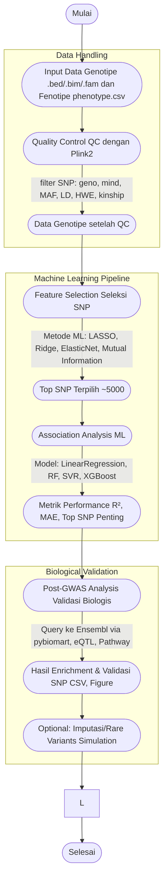

Berikut adalah contoh README.md untuk program pipeline GWAS-with-ML versi modular Python (dengan plotting, parameter .env, dan berbasis conda/docker):

# GWAS-with-ML Pipeline

Pipeline ini menyediakan analisis Genome-Wide Association Study (GWAS) terintegrasi Machine Learning untuk deteksi, validasi, dan interpretasi varian genetika terkait fenotipe kompleks. Versi ini sepenuhnya modular dalam Python, dapat dijalankan di lingkungan conda maupun Docker Compose, dan mendukung parameterisasi dinamis melalui `.env`.

## Fitur Utama

- **Quality Control** (Plink2): Otomatis pembersihan data genotipe (.bed/.bim/.fam)
- **Feature Selection**: Seleksi SNP relevan dengan LASSO, Ridge, ElasticNet, Mutual Information
- **Association Analysis**: Model ML (Linear Regression, Random Forest, SVR, XGBoost) untuk prediksi & ranking SNP
- **Performance Plotting**: Grafik per model (R², MAE) secara otomatis, tersimpan di `data/image`
- **Post-GWAS Analysis**: Validasi biologis/top SNP dengan enrichment (pybiomart, Ensembl)
- **Parameter via `.env`**: Semua threshold, n-top, alpha, dst. dipisahkan dalam file config yang mudah diubah
- **Mudah dijalankan di Docker/Conda**: Satu perintah, tanpa edit kode utama

## Struktur Direktori

```
.
├── gwas_pipeline.py         # Skrip utama pipeline (modular & siap produksi)
├── environment.yml          # Definisi environment Conda (semua dependency)
├── Dockerfile               # Dockerfile Miniconda untuk containerisasi
├── docker-compose.yml       # Konfigurasi Docker Compose
├── .env                     # Parameter pipeline (threshold, alpha, dsb)
├── data/
│   ├── input_prefix.*       # Data genotipe (.bed, .bim, .fam hasil QC)
│   ├── phenotype.csv        # File fenotipe (see format below)
│   └── image/               # Output grafik per model ML
└── README.md                # Dokumen ini
```

## Prasyarat

- **Conda (Miniconda/Anaconda)** ATAU Docker
- Untuk Docker: docker & docker-compose/buildx terbaru

## Cara Instalasi & Pemakaian

### 1. Jalankan di Conda

1. **Buat environment:**
    ```bash
    conda env create -f environment.yml
    conda activate gwasml
    ```
2. **Edit `.env` (opsional):** Atur threshold, n-features dsb sesuai kebutuhan.
3. **Jalankan pipeline:**
    ```bash
    python gwas_pipeline.py data/input_prefix data/phenotype.csv
    ```

### 2. Jalankan di Docker Compose

1. **Build image:**
    ```bash
    docker compose build
    ```
2. **Jalankan pipeline:**
    ```bash
    docker compose up -d    # Detached (background); cek log dengan docker compose logs -f gwasml
    ```
    Atau override input files:
    ```bash
    docker compose run gwasml data/input_prefix data/phenotype.csv
    ```

3. **Hasil (grafik, enrichment) di-folder**:
    - `data/image/` untuk plot R²/MAE per model
    - `enrichment.csv` untuk hasil validasi biologis SNP

## Format Data Input

### Data Genotipe
- File trio: `input_prefix.bed/.bim/.fam` (Plink format hasil QC atau mentah)
- Setelah QC otomatis, file hasil di `data/qc_output.*`

### File Fenotipe (`phenotype.csv`)
```csv
FamID,CAD,sex,age,tg,hdl,ldl
10002,1,1,60,NA,NA,NA
10004,1,2,50,55,23,75
...
```
- Minimal: kolom ID (FamID/IID) dan target fenotipe (misal: LDL)
- NA boleh, akan di-handle di preprocessing

## Cara Setting Parameter

Edit file `.env` untuk threshold, n-features, alpha, dsb:

```
FEATURE_SELECTION_N_FEATURES=5000
FEATURE_SELECTION_LASSO_ALPHA=0.00045
ASSOCIATION_RF_N_ESTIMATORS=100
...
```
**Cukup ubah file .env – tanpa edit kode Python!**

## Skema Pipeline



## Troubleshooting

- Jika error buildx: install buildx plugin (lihat README troubleshooting)
- Jika log kosong: cek path folder `data` & isi file input benar
- Jika docker: selalu build dulu (`docker compose build`)

## Lisensi dan Credit

- Berbasis pada pipeline dan protokol GWAS-with-ML (Vaishnavi Jangale et al, PennCATH).
- Kode modular ini bebas diadaptasi untuk riset dan pendidikan.

**Q & A**  
Untuk pertanyaan lebih lanjut atau contoh data, silakan hubungi maintainer repo.

---